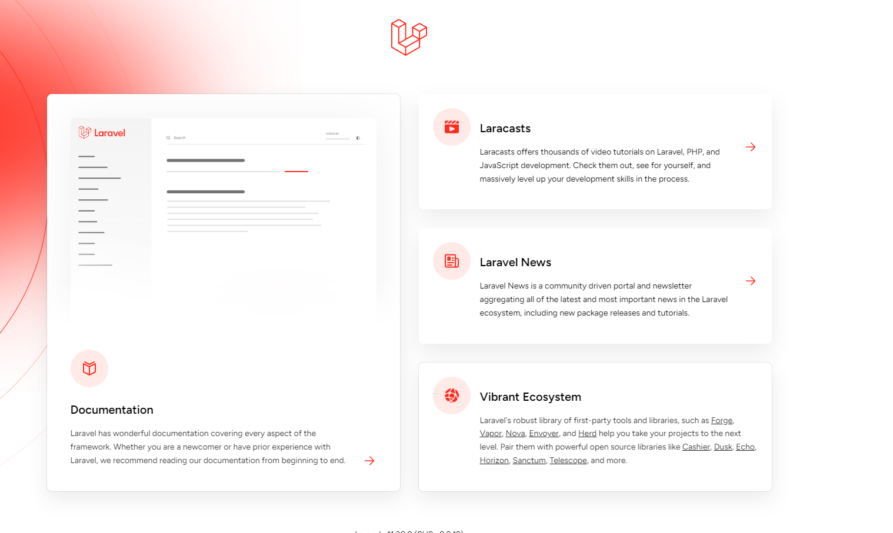

# 認証と認可の理解(laravel Breeze,SQL)

- [**認証（Authentication）と認可（Authorization）の違いを理解できる。**](#認証と認可の違いを理解する)

- **パスワード認証の基本を理解し、ユーザーが提供するクレデンシャルを使ってユーザーを認証するプロセスを説明できる。**

- [**ユーザーIDとパスワードを使ったシンプルなログインフォームを作成し、ユーザー情報をデータベースに保存して認証することができる。**](#認証の全体的な流れ)

- [**認可の基本的な概念（ユーザーのアクセス権限を制御するプロセス）を理解している。**](Authorization.md)

- [**セッションベースの認証を理解し、セッションIDをサーバーサイドで管理することでユーザーを追跡する仕組みを説明できる。**](Session.md)

- [**クッキーの役割を理解し、セッション管理に利用することができる。**](Cokkie.md)

- [**ロールベースのアクセス制御（RBAC）の基本を理解し、異なるユーザーロールに基づいたアクセス権限を設定することができる。**](RBAC.md)

- [**トークンベースの認証（JWTなど）を理解し、セッションベースの認証との違いを説明できる。**](JWT.md)

- [**Bearerトークンの概念を理解し、HTTPヘッダを利用してAPIリクエストを認証する仕組みを説明できる。**](BearerToken.md)

- [**OAuth 2.0プロトコルを理解し、外部プロバイダ（Google, Facebookなど）を使用したシングルサインオン（SSO）を実装できる**](OAuth2.0.md)

## 認証と認可の違いを理解する

## 認証（Authentication）とは？

認証は「あなたは誰ですか？」と確認するプロセスです。たとえば、家に入るときにドアに鍵をかけている場合、鍵（パスワード）を使って「この人は家の所有者です」と確認します。

**比喩:** 認証は、映画館のチケットを見せて「この人は入場許可を持っている」と確認するようなものです。

## 認可（Authorization）とは？

認可は「あなたには何が許可されていますか？」と決めるプロセスです。例えば、家に入った後、リビングルームには入れるけど、書斎には入れないというように、アクセスできる場所を制限します。

**比喩:** 映画館で、普通のお客さんは一般席に座れるけど、VIPチケットを持っている人だけが特別な席に座れるようなものです。

## laravel Breezeのインストール

```bash
# プロジェクトディレクトリlaravel-authを作成
composer create-project laravel/laravel laravel-auth 

# プロジェクトディレクトリに移動
cd laravel-auth
```

## laravelとは？

https://www.sejuku.net/blog/258384 (Laravelとは？PHPフレームワークの特徴やできること、使い方も紹介)

https://jp-seemore.com/web/6710/ (PHP Laravel完全解説！初心者でも理解できる10のステップ)

https://youtu.be/I-enAc-JLpw?si=v2h9ZyzUFysZhinZ
(Laravel入門：MVC完全攻略)

https://youtu.be/M58aCituLYc?si=PFQO2PhC8TrXzWnL(ミドルウェアを含めて)

https://youtu.be/eEEkESAq-fA?si=VpOiFSTYuNV-w60S（ミドルウェアとは？）

MVCのイメージ

- PHPで開発されたオープンソースのWebアプリケーションフレームワーク

## Laravelのリクエスト処理の流れ (大事)

1. リクエストの送信（ユーザーがブラウザでアクセス）
2. ルーティングの決定（web.phpでルートが設定）
3. コントローラーによる処理（ビジネスロジックの実行）
4. モデルを通じたデータ取得（データベースとのやり取り）
5. ビューの生成（BladeテンプレートでHTMLを作成）
6. レスポンスの返却（ユーザーにページを表示）


```bash
# 開発サーバーの立ち上げ
php artisan serve
```

ブラウザを開いてhttp://localhost:8000にアクセスします。Laravelのウェルカムページが表示されれば成功



## laravel Breezeの導入

- Laravelフレームワークにおける認証機能を迅速かつ簡単に実装するための軽量なスターターパッケージ(準備されている)
  
  ユーザー登録、ログイン、パスワードリセットなどの基本的な認証機能が自動的に生成される

```bash
# Laravel Breeze パッケージを開発環境にインストール

composer require laravel/breeze --dev

# Breezeのセットアップ

php artisan breeze:install

# laravel-auth内にnode_modulesがない場合行う
# package.json ファイルに記載されている依存関係をインストール

npm install

```

## マイグレーションの実行

データベースに必要なテーブルを作成します。

.env ファイルを開き、データベースの接続情報を設定します。

```bash
# 実際のデータベース情報に置き換えてください

DB_CONNECTION=mysql
DB_HOST=127.0.0.1
DB_PORT=3307
DB_DATABASE=laravel_auth
DB_USERNAME=root
DB_PASSWORD=root

```

```bash
# データベースのテーブルやカラムの作成、変更、削除などの操作をコードとして記述し、これを実行することでデータベースに反映させることができます

php artisan migrate

```

1. laravel-auth/database/migrations ディレクトリ内にある全てのマイグレーションファイルを読み込みます

2. タイムスタンプ順(YYYY_MM_DD_HHMMSS_create_users_table.php
)にマイグレーションを実行します。これにより、依存関係のあるマイグレーションが正しい順序で適用されます。

3. テーブルが存在しない場合,最初のマイグレーション実行時に自動的に作成されます。

4. 未実行のマイグレーションファイルに記述された **up メソッド**が順次実行され、データベーススキーマが更新されます。

**up メソッド**　には、テーブルの作成、カラムの追加・変更、インデックスの設定など、データベース構造の変更が定義されています。

**down メソッド**　はデータベースの変更を元に戻す（ロールバックする）ために使用されます。

```bash
# 実行された全てのマイグレーションファイルの down メソッドが順次実行され、データベースが初期状態に戻ります。

php artisan migrate:reset

```

## 認証の全体的な流れ

web.phpとauth.phpの役割

例
### 1. web.php：オフィスのメインフロア

### 役割

オフィス全体の一般的な業務や、主要な業務フローを管理します。

- 例：全社的な会議、部署間の連絡、一般的な問い合わせなど。

#### 具体例

- ホームページの表示
- ダッシュボードへのアクセス
- 管理者専用のユーザー管理機能

### 2. auth.php：セキュリティ部門

#### 役割
オフィス内のセキュリティ関連の業務を専門的に管理します。
- 例：社員の入退室管理、セキュリティ認証、パスワードリセットなど。

#### 具体例
- ユーザー登録
- ログイン・ログアウト
- パスワードリセット
- メール認証

---

## ページの説明

- [登録画面](#登録画面)
- [ログイン画面](#ログイン画面)

## http://localhost:8000 にアクセスされここはwelcome.blade.phpを表示しています

```php
// routes/web.php
Route::get('/', function () {
    return view('welcome');
});
```

resources/views/welcome.blade.phpがレンダリングされ、ユーザーに表示されます。

## 登録画面

```php
//welcome.blade.php 28行目
href="{{ route('register') }}"
```

Bladeテンプレートエンジンが`{{ route('register') }}`を処理し、名前付きルートregisterに対応するURLを生成します。例えば、http://localhost:8000/register になります。

ユーザーがこのリンクをクリックすると、ブラウザは`GET /register`リクエストをサーバーに送信します。

```php
// Auth.php

# ユーザーが登録ページにアクセスするときのルート
Route::get('/register', [RegisteredUserController::class, 'create'])
    ->middleware('guest')
    ->name('register');
```

http://localhost:8000/register 登録ページにアクセス

この時、HTTPの`GET`リクエストがサーバーに送信されます。

`GET /register` にマッチするルートを見つけ、`RegisteredUserController` の `create` メソッドを呼び出します。

`->middleware('guest')` 'guest'ミドルウェアは、**未認証ユーザー（ゲスト）**のみにアクセスを許可し、認証済みユーザー（ログイン済みユーザー）がアクセスしようとした場合にはリダイレクト

`->name('register');`
ルートに名前を付けることで、コード内でそのルートを簡単に参照できるようになり,
route('register')といったヘルパー関数を使用してURLを生成できるため、コードが読みやすくなります。

```php
public function create(): View
{
    return view('auth.register');
}
```

`return view('auth.register');`

resources/views/auth/register.blade.phpというBladeテンプレートを読み込み、それをHTMLとしてユーザーのブラウザに送信し表示しています。

---
なぜ`.`なの、`/`でよくない？

`viewヘルパー関数`は、Laravelでビューを簡単に管理・表示するための強力なツールです。ドット表記を理解することで、ビューの指定が直感的になり、開発効率が向上します。

---

```php
// register.blade.php
<form method="POST" action="{{ route('register') }}">
@csrf
```

- `method="POST"`：フォームデータをサーバーに送信する方法。POSTはデータを送信して新しい情報を作成する際に使われます。
- `action="{{ route('register') }}"`：フォームが送信される先のURLを指定します。ここでは、`register`という名前のルートに送信されます。
- `@csrf`：セキュリティ対策として、CSRF（クロスサイトリクエストフォージェリ）トークンを含めます。これにより、悪意のあるリクエストを防ぎます。

#### `CSRF攻撃`は、ユーザーが意図しないリクエストを第三者がユーザーに代わって送信させる攻撃手法です。例えば、ユーザーがログインしている状態で悪意のあるサイトにアクセスすると、そのサイトがユーザーの意図しない操作（例えば、パスワードの変更や購入の実行）を行うリクエストを送信することがあります。


CSRFトークンの仕組み

1. トークンの生成:
サーバー側でランダムな文字列（トークン）を生成します。
このトークンはユーザーのセッションに保存されます。

2. フォームへの埋め込み:
 フォーム送信時に、このトークンを隠しフィールドとしてフォームに埋め込みます。

3. リクエスト時の検証:
ユーザーがフォームを送信すると、サーバーは送信されたトークンと
セッションに保存されたトークンを比較します。

トークンが一致すれば、リクエストが正当なものであると認識し、処理を続行します。

一致しなければ、リクエストを拒否します。

---

 送信先のURL: フォームの`action`属性で指定されたURL（通常は`/register`）にデータが送られます。

```php
// auth.php

# ユーザーが登録フォームを送信するときのルート
Route::post('/register', [RegisteredUserController::class, 'store'])
->middleware('store');
```

`GET /register` にマッチするルートを見つけ、`RegisteredUserController` の `create` メソッドを呼び出します。

```php
// RegisteredUserController.php

# ユーザーが登録フォームに入力した情報を使って、新しいユーザーアカウントをデータベースに保存

public function store(Request $request): RedirectResponse
{
    $request->validate([
        'name' => ['required', 'string', 'max:255'],
        'email' => ['required', 'string','email', 'max:255', 'unique:'.User::class],
        'password' => ['required', 'confirmed', Rules\Password::defaults()],
    ]);

    $user = User::create([
        'name' => $request->name,
        'email' => $request->email,
        'password' => Hash::make($request->password),
    ]);

    event(new Registered($user));

    Auth::login($user);

    return redirect(RouteServiceProvider::HOME);
}
```

`$request->validate([...])`  ユーザーがフォームに入力したデータが正しいかどうかを確認

`required`: 必須項目。空ではいけません。

`string`: 文字列であること。

`max:255`: 最大255文字まで。

`email`:正しいメールアドレス形式であること

`unique:'.User::class`: usersテーブル内で一意であること（同じメールアドレスが既に存在しないこと）。

`confirmed`: password_confirmationフィールドと一致すること。

---

`User::create([...]);`  新しいユーザーをデータベースに追加するための命令
`Rules\Password::defaults()`: Laravelが提供するデフォルトのパスワード強度ルールを適用（例えば、最低文字数や文字の種類の要件など）。

`$request->name, $request->email, $request->password`は、ユーザーが登録フォームに入力したデータを取得しています。

`Hash::make`はユーザーが入力したパスワードを安全に暗号化（ハッシュ化）しています。

---
`event(new Registered($user));`

- 特定のアクション（イベント）が発生したときに、そのイベントに対応するリスナー（リスニングする側）が特定の処理を実行する

- 新しいユーザーが登録されたときに、関連する処理（例えば、メールの送信やログの記録）を実行するために使用されます(今はリスナーが設定されていないので、何も起こりません。)


---

`Auth::login($user);`

ユーザーをログイン状態に設定:

- 指定されたユーザーを認証済みとして扱い、セッションにユーザー情報を保存します。

セッション認証の実現:

- Laravelのセッションシステムを利用して、ユーザーの認証状態を維持します。

---

`return redirect(RouteServiceProvider::HOME);`

```php
#RouteServiceProviderクラス内で定義された定数

public const HOME = '/dashboard';
```

ここでHOMEという定数が定義されており、その値は'/dashboard'です。
これは、ユーザーがログインや登録後にリダイレクトされるデフォルトのパスを示します。

---

## ログイン画面

```php

//welcome.blade.php 25行目

href="{{ route('login') }}"
```

Bladeテンプレートエンジンが{{ route('login') }}を処理し、名前付きルートloginに対応するURLを生成します。例えば、http://localhost:8000/login になります。

ユーザーがこのリンクをクリックすると、ブラウザは`GET /login`リクエストをサーバーに送信します。

```php

Route::get('/login', [AuthenticatedSessionController::class, 'create'])
    ->middleware('guest')
    ->name('login');

```

`GET /login` にマッチするルートを見つけ、`AuthenticatedSessionController` の `create` メソッドを呼び出します。

```php
 public function create(): View
    {
        return view('auth.login');
    }

```

`return view('auth.login');`

resources/views/auth/login.blade.phpというBladeテンプレートを読み込み、それをHTMLとしてユーザーのブラウザに送信し表示しています。

---

```php
// login.blade.php

<form method="POST" action="{{ route('login') }}">
     @csrf
```

 送信先のURL: フォームの`action`属性で指定されたURL（通常は`/login`）にデータが送られます。

```php
// auth.php

# ユーザーがログインフォームを送信するときのルート
Route::post('/login', [AuthenticatedSessionController::class, 'store'])
    ->middleware('guest');
```

`GET /login` にマッチするルートを見つけ、`AuthenticatedSessionController` の `store` メソッドを呼び出します。

```php
// AuthenticatedSessionController.php

# ユーザーがログインフォームを送信したときに実行される

    public function store(LoginRequest $request): RedirectResponse
    {
        $request->authenticate();

        $request->session()->regenerate();

        return redirect()->intended(RouteServiceProvider::HOME);
    }
```

`LoginRequest $request` ログインフォームから送信されたデータを含んでいます
$request->authenticate();

`$request->session()->regenerate();`  セッションIDを再生成します

`return redirect()->intended(RouteServiceProvider::HOME);`

```php
#RouteServiceProviderクラス内で定義された定数

public const HOME = '/dashboard';
```

ここでHOMEという定数が定義されており、その値は'/dashboard'です。
これは、ユーザーがログインや登録後にリダイレクトされるデフォルトのパスを示します。


---