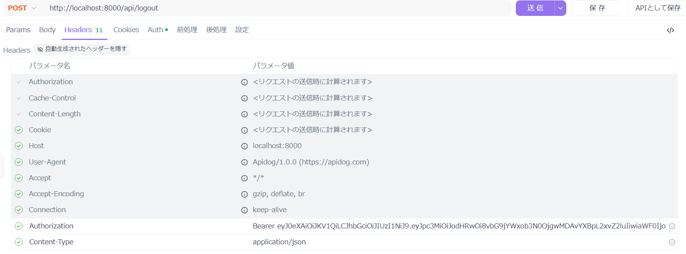
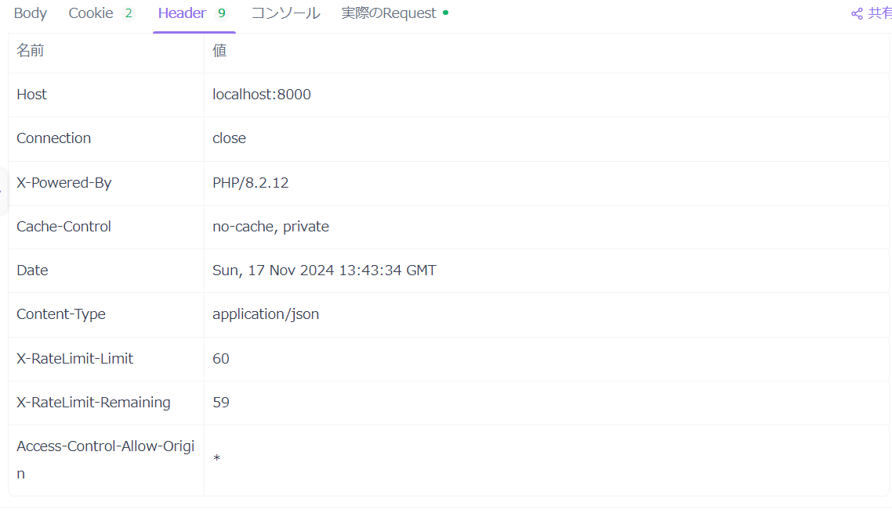
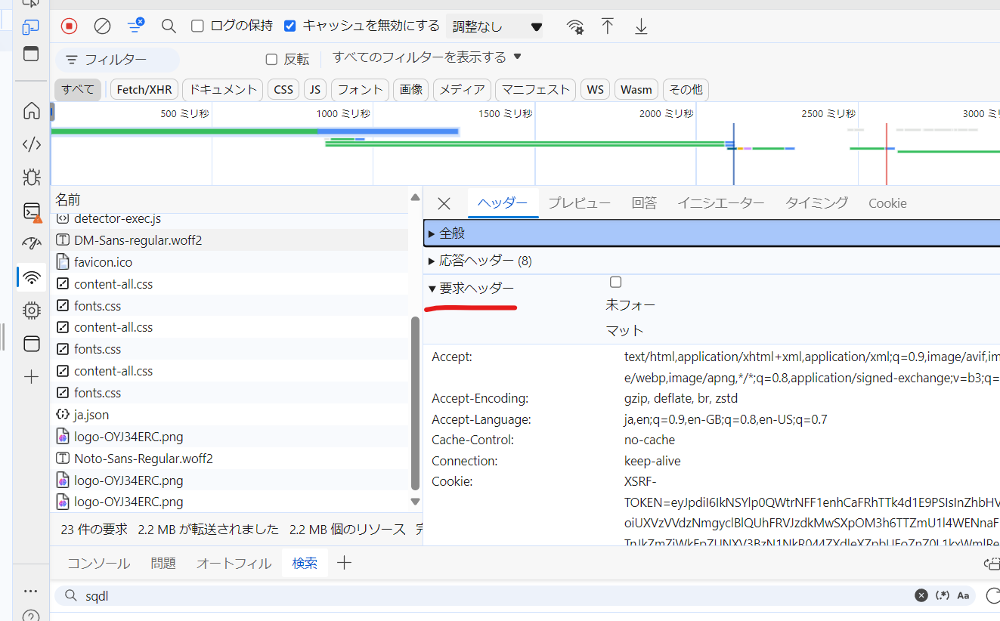
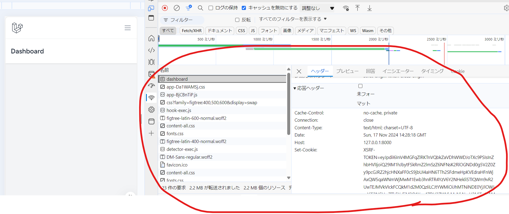

# Bearerトークンの概念を理解し、HTTPヘッダを利用してAPIリクエストを認証する仕組みを説明できるようになる


# Bearerトークンとは？

Bearerトークンは、認証情報として使用される文字列で、APIリクエストの認証に利用されます。トークンを「持っている（bear）」人がその権限を持つとみなされるため、「Bearer（持ち主）」という名前が付いています。

## API認証とは？

API認証は、APIにリクエストを送る際に、そのリクエストが正当なユーザーやアプリケーションから送られたものかを確認する仕組みです。

## BearerトークンとJWTの関係

`Bearerトークン`は認証に使われるトークンの「形式」や「仕組み」を指します。

**JWT（JSON Web Token）**はそのトークンの「内容（形式の一つ）」です。

## BearerトークンとJWTの関係を例えると

- Bearerトークンは「映画のチケット」と考えられます。どんな形のチケットでも使えます（紙のチケットでも、デジタルQRコードでもOK）。

- JWTは「デジタルQRコードのチケット」のようなもの。中身（名前、日時、座席番号など）が暗号化されていて自己完結しているため、QRコードをスキャンするだけで有効性が確認できます。

- OAuth認証
- セッション認証
-ベーシック認証

もBearerトークン認証といえる！


## HTTPヘッダとは？

```
HTTPヘッダは、ウェブサイト（サーバー）とブラウザやアプリ（クライアント）が通信を行うときに使う情報のやりとりのメモです。
「どんなデータを送るのか」「どんな形式で受け取りたいのか」「自分はどんな人（ブラウザやアプリ）か」などを伝えるために使います。
```

## HTTPヘッダの役割

通信のルールを伝える

- 例: 「このデータはJSON形式ですよ」「文字コードはUTF-8を使っています」など。
クライアントの情報を伝える

- 例: 「私はGoogle Chromeです」「スマホからアクセスしています」など。
セキュリティや認証情報を伝える

- 例: 「このリクエストは認証済みユーザーからのものです（トークン付き）」など。
効率を上げるための情報を提供

- 例: 「このデータはキャッシュしてもOKです」など。

## HTTPヘッダの種類

## 1.リクエストヘッダ

## 代表的なリクエストヘッダ:


APIDogのこれに当たる



- User-Agent: ブラウザやアプリの情報を伝える。
例: "Mozilla/5.0 (Windows NT 10.0; Win64; x64)"（Chromeからのアクセス）。

- Accept: クライアントが受け取れるデータ形式。
例: "text/html"（HTML形式でください）。

- Authorization: 認証情報（例: Bearerトークン）。
例: "Bearer eyJhbGciOi..."。

## 2.レスポンスヘッダ

- サーバーがクライアントにデータを返す際に添える情報。
- 例:
「このデータはHTML形式です」「キャッシュしてOKです」。

## 代表的なレスポンスヘッダ:

APIDogだとこれ



デベロッパーツールだとこれ(要求ヘッダー)


- Content-Type: サーバーが返すデータの種類を伝える。
例: "text/html; charset=UTF-8"。


- Set-Cookie: クライアントにクッキーを保存するよう指示。
例: "sessionid=abc123; Path=/; HttpOnly"。


## エンティティヘッダ

データ自体の詳細情報を伝えるためのヘッダ。
例:
「データのサイズは1MBです」「データはGZIPで圧縮されています」。

## 代表的なエンティティヘッダ:

デベロッパーツールだとこれ(応答ヘッダー)


Content-Length: データのサイズをバイト単位で指定。
例: "1024"（1024バイトのデータ）。
Content-Encoding: データがどのように圧縮されているかを指定。
例: "gzip"。