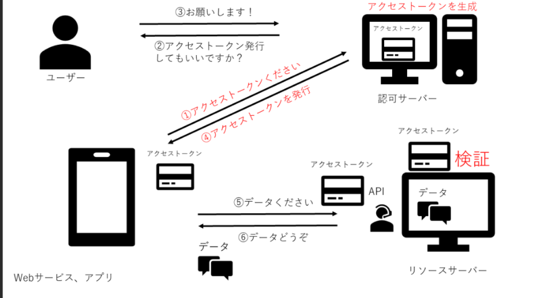

# OAuth 2.0プロトコルを理解し、外部プロバイダ（Google, Facebookなど）を使用したシングルサインオン（SSO）を実装できる

## OAuth 2.0とは？

1. ユーザーがログインをリクエスト: クライアント（アプリケーション）が外部プロバイダ（例: Google）に認証をリクエストします。

2. 外部プロバイダが認証ページを表示: ユーザーはGoogleのログインページで認証を行います。

3. 認可コードの取得: 認可サーバーがアプリケーションに認可コードを返します。

4. アクセストークンの取得: 認可コードを使って、アクセストークンを取得します。

5. データの取得: アクセストークンを使って、外部プロバイダからユーザーの情報（例: 名前、メールアドレス）を取得します。

https://qiita.com/TakahikoKawasaki/items/e37caf50776e00e733be

https://zenn.dev/crebo_tech/articles/article-0011-20241006