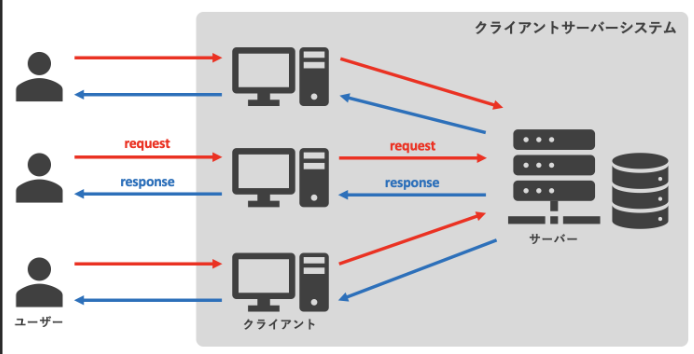
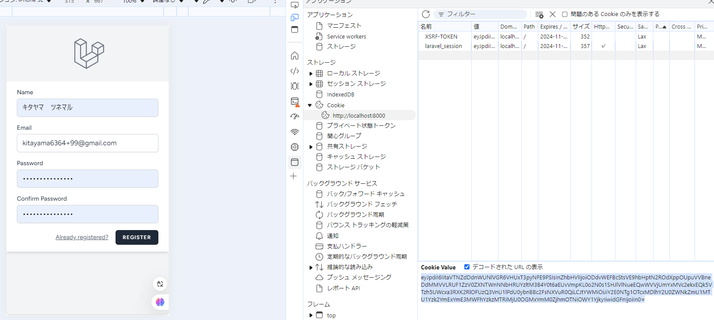
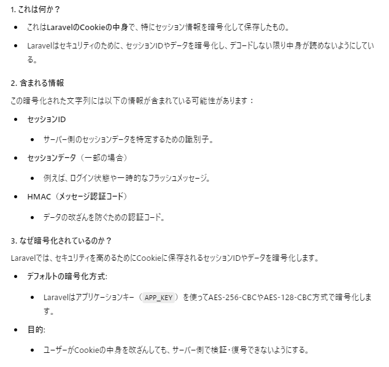
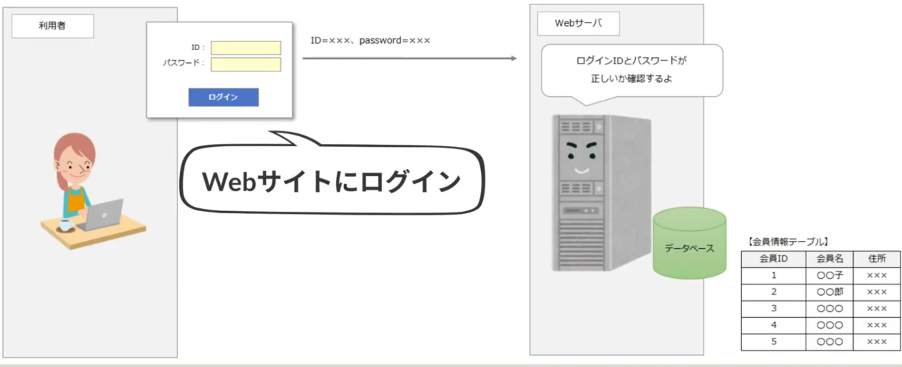
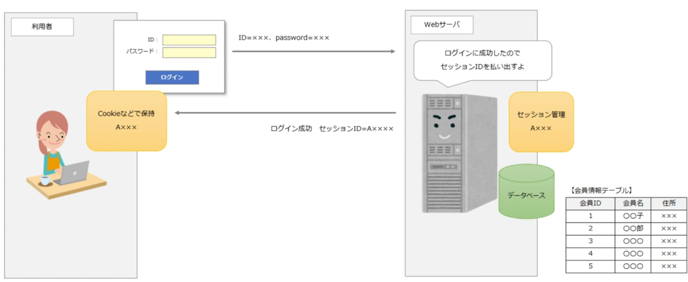
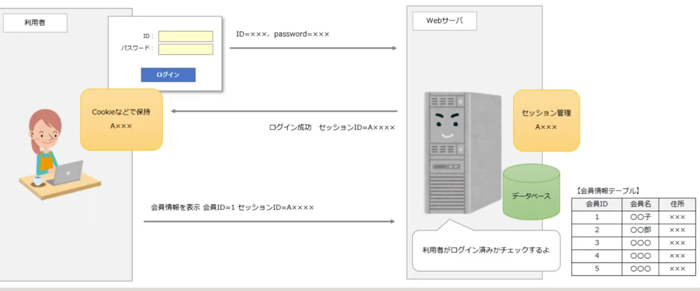
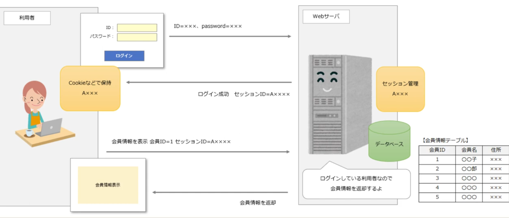
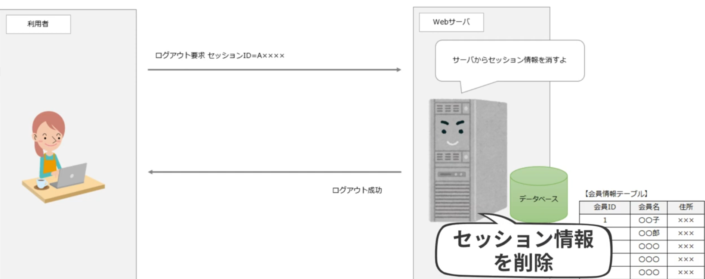

# セッションベースの認証とは

## 概要

セッションベースの認証は、ユーザーがウェブアプリケーションにログインする際に、サーバー側でセッションを作成し、クライアント側（通常はブラウザ）にセッションIDをクッキーとして保存させる認証方法です。以降のリクエストでは、このセッションIDを使用してユーザーの認証状態を確認します。

---
## クライアントとサーバーの関係

具体的な例：ChatGPTを使った流れ

ユーザーがChatGPTのウェブサイトにアクセスし、質問を入力する。

1. 人間 → クライアント（ウェブブラウザ）

ウェブブラウザが質問内容をOpenAIのサーバーに送信する。

2. クライアント → サーバー

サーバーが質問を処理し、適切な回答を生成する。

3. サーバー（処理）

サーバーが生成した回答をウェブブラウザに返送する。

4. サーバー → クライアント(ウェブブラウザ)

ウェブブラウザが回答をユーザーに表示する。

5. クライアント → 人間

## 主な特徴

https://youtu.be/JYaELUsLo_U?si=dOLBUZNYP6hica3q

- **状態を保持**: サーバー側でユーザーの状態（ログイン状態など）を保持します。
- **クッキーの利用**: クライアント側にセッションIDをクッキーとして保存し、リクエストごとに送信します。
- **セキュリティ**: セッションIDは推測困難なランダムな文字列であり、安全に管理されます。

---

## Laravelでのセッション設定

Laravelでは、セッションの保存方法をセッションドライバーで設定できます。`config/session.php`ファイルで確認し、必要に応じて以下のような設定を行いましょう。

- **セキュリティ設定**: secure、http_only、same_siteなどを適切に設定し、アプリケーションの運用環境に合わせたセキュリティレベルを確保します。

---

## セッションIDの生成と保存の流れ

1. **ユーザーの認証**: ユーザーがログインすると、Laravelは新しいセッションを生成し、セッションIDを作成します。
2. **クッキーへの保存**: セッションIDは、クライアントのブラウザにクッキーとして保存されます（デフォルトでは `laravel_session` という名前）。
3. **サーバー側の保存**: セッションデータは、選択したドライバーに基づいてサーバー側に保存されます。たとえば、`file` ドライバーを選択した場合、`storage/framework/sessions` ディレクトリにファイルとして保存されます。

---

## `storage/framework/sessions` ディレクトリ内のファイルの構成

セッションデータはシリアライズされた文字列として保存され、**連想配列（キーと値のペア）**で構成されています。主要なキーは以下の通りです：

- `_token`: CSRFトークンを保持
- `_flash`: フラッシュメッセージ用のデータ
- `_previous`: 前回のリクエスト情報

---

## 1.(`a:3:{...}`)

- **意味**: 配列（array）であり、要素数は3つです。

---

## 2. `_token`(（Cross-Site Request Forgery対策用トークン）)
- **キー**: `_token`
- **タイプ**: 文字列（string）
- **長さ**: 6文字
- **値**: `"IXobhuTLbJictJ0e9a3YGGZ8Lx855GEFQ9IjKguQ"`
  - **タイプ**: 文字列（string）
  - **長さ**: 40文字
- **説明**: 
  - これは**CSRF（クロスサイトリクエストフォージェリ）トークン**です。フォーム送信時に、サーバー側でリクエストが正規のものかを検証するために使用される。
  Laravelは自動的にフォームにこのトークンを埋め込み、リクエストのトークンと照合してCSRF攻撃を防ぐ。

- 値の例:

  - "yJGbTv7LZkheow7KNRYDHfUQyybep5ZfNu4TKL8g" はランダムに生成される文字列。

---

## 3. `_flash`
- **キー**: `_flash`
- **タイプ**: 文字列（string）
- **長さ**: 6文字
- **値**: 配列（array）
  - **要素数**: 2つ
  - **内容**:
    - `old`: 空の配列
    - `new`: 空の配列
- **説明**: 
  - これは**フラッシュデータ**を管理するための構造です。フラッシュデータは一度だけ表示されるメッセージ（例：成功メッセージやエラーメッセージ）を保持します。ここでは`old`と`new`が空のため、現在フラッシュデータは存在しない状態です。

---

## 4. `_previous`
- **キー**: `_previous`
- **タイプ**: 文字列（string）
- **長さ**: 9文字
- **値**: 配列（array）
  - **要素数**: 1つ
  - **内容**:
    - `url`: `"http://127.0.0.1:8000/register"`
      - **タイプ**: 文字列（string）
      - **長さ**: 30文字
- **説明**: 
  - このデータは前回のリクエストURLを保持しています。例えば、バリデーションエラーが発生した場合、フォームページに戻る処理に利用される。

---
---

## 注意点
- **セッションの管理**: セッションの保存場所やセキュリティ設定を環境に応じて適切に設定することで、安全性を確保します。
- **セキュリティ設定**: 特に`secure`、`http_only`、`same_site`の設定は、セッションの安全性に大きく関わります。

---

## 含まれていない情報
このセッションデータには、以下の情報は含まれていません：

- ユーザー名（例: John Doe）
- メールアドレス（例: john@example.com）
- その他の個人情報（住所や電話番号など）

これらの情報は、セッションデータではなく、データベースに保存されています。必要なときに、ユーザーID を使ってデータベースから取得する仕組みです。
## ログイン処理

セッションID:利用者を識別するID

cookieはブラウザに保存される(デベロッパーツールで確認できる)

セッション管理:セッションIDを用いて通信相手の状態を管理すること

Laravelでは、Cookie（例: laravel_session）にセッションIDが保存され、このセッションIDを使ってサーバー側のセッションデータを特定し、ユーザーの状態を管理します。

## ログアウト処理

---

| 項目       | セッションID                                      | セッションデータ                                      |
|------------|--------------------------------------------------|------------------------------------------------------|
| 役割       | セッションデータを特定するための識別子（鍵）。    | ユーザーの状態や一時的なデータ（実際のデータ）。    |
| 保存場所   | クライアント側（Cookieに保存）。                  | サーバー側（デフォルトでは storage/framework/sessions に保存）。 |
| データの内容 | ランダムな文字列（例: a7b23c9e40bdf2a84e0af0cfa8572b7a1c3e8f2d）。 | CSRFトークン、ユーザーID、フラッシュメッセージなど。 |
| セキュリティ | Laravelでは暗号化されてCookieに保存されるため、改ざんされにくい。 | サーバー側のみで管理されるため、クライアントから直接アクセスできない。 |
| やり取り   | クライアントとサーバー間でやり取りされる（Cookie経由）。 | サーバー内部でのみ利用される。                      |

